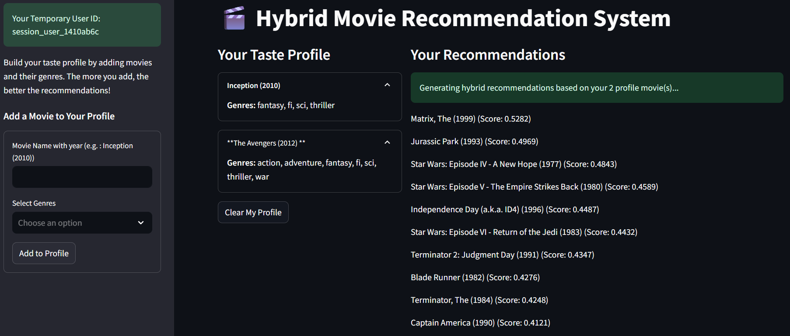

# Hybrid Movies Recommendation System

This project is a high-performance, hybrid movie recommendation system built in Python. It's deployed as a Streamlit application that provides intelligent recommendations for new users based on their custom-built taste profiles.

The system uses a sophisticated hybrid model that blends four distinct recommendation techniques:

1.  **Popularity-Based Filtering:** Used as a "cold start" solution. It calculates a weighted average rating (similar to IMDB's) to identify and rank the most popular movies. This is shown to users who have not yet built a profile.
2.  **Content-Based Filtering (CBF):** Uses a `TfidfVectorizer` on movie genres to understand the *content* of each movie. It calculates which movies are most similar to a user's taste profile.
3.  **Collaborative Filtering (CF):** Uses Matrix Factorization (SVD) on the entire user-rating dataset to learn latent user and movie features. This model understands "what users like you also liked."
4.  **Hybrid Model:** The final model intelligently combines **Content-Based Filtering** and **Collaborative Filtering** for new users. It creates a weighted average of:
    * **Content Score:** "How similar is this movie to the genres in your profile?"
    * **General CF Score:** "How popular is this movie according to the collaborative filtering model (i.e., what do all users generally think of it)?"
  
---

---

## Features

* **Real-time Hybrid Recommendations:** Provides instant recommendations for new users.
* **Dynamic Taste Profile:** Users can create a session-based profile by adding movies and their associated genres.
* **Cold Start Solution:** Uses a randomized list of top-rated popular movies for users with an empty profile.
* **Efficient & Scalable:** The system is split into two parts:
    1.  A one-time **training script** that pre-computes all models.
    2.  A lightweight **Streamlit app** that loads the saved artifacts for instant inference (no re-training).
* **Memory-Efficient:** Avoids memory crashes by calculating similarity "just-in-time" (JIT) instead of pre-calculating a massive cosine similarity matrix.

---

## How to Run

This project requires a two-step process: training the models and then running the app.

### 1. Training the Models

First, you must run the training script to generate all the necessary artifact files from your `movies.csv` and `ratings.csv` data.

**Prerequisites:**
* `pandas`
* `numpy`
* `scikit-learn`
* `scipy`
* `joblib`

**Script:**
Run the `train_and_save_model.py` script.

```bash
python train_and_save_model.py
````

This will consume `movies.csv` and `ratings.csv` and output the following files:

  * `popular_movies_df.pkl`
  * `seen_movies_map.pkl`
  * `content_based_tfidf_vectorizer.joblib`
  * `tfidf_matrix.npz`
  * `indices_map.pkl`
  * `predicted_ratings_matrix.npy`
  * `user_id_to_idx.pkl`

### 2\. Running the Streamlit App

Once all the artifact files are present in the same directory, you can run the Streamlit application.

**Prerequisites:**

  * `streamlit`
  * All libraries from training.

**Script:**
Run the `main.py` script from your terminal.

```bash
streamlit run main.py
```

This will launch a local web server and open the application in your browser.


## Saved Model Artifacts

This project works by saving a collection of pre-trained artifacts.

  * `movies.csv`: (Input) Your raw movie data (ID, title, genres).
  * `ratings.csv`: (Input) Your raw user ratings data (userID, movieID, rating).

-----

  * **`popular_movies_df.pkl`**: (Popularity Model) A saved Pandas DataFrame containing all movies, pre-sorted by their weighted popularity score.
  * **`seen_movies_map.pkl`**: (Helper) A large dictionary mapping every `userId` to a list of `movieId`s they have already rated.
  * **`tfidf_vectorizer.joblib`**: (Content Model) The saved `TfidfVectorizer` object, trained on the movie genres. Used to understand the genres a new user selects.
  * **`tfidf_matrix.npz`**: (Content Model) The core sparse matrix (`[n_movies x n_genres]`) of TF-IDF scores for all movies.
  * **`indices_map.pkl`**: (Content Model) A helper `pd.Series` that maps movie titles back to their index in the matrix.
  * **`predicted_ratings_matrix.npy`**: (Collaborative Model) The core of the CF model. A massive `numpy` array (`[n_users x n_movies]`) containing the *predicted* rating for every user-movie pair.
  * **`user_id_to_idx.pkl`**: (Collaborative Model) A helper dictionary that maps public-facing `userId`s to their internal row index in the `predicted_ratings_matrix`.

<!-- end list -->

```
```
